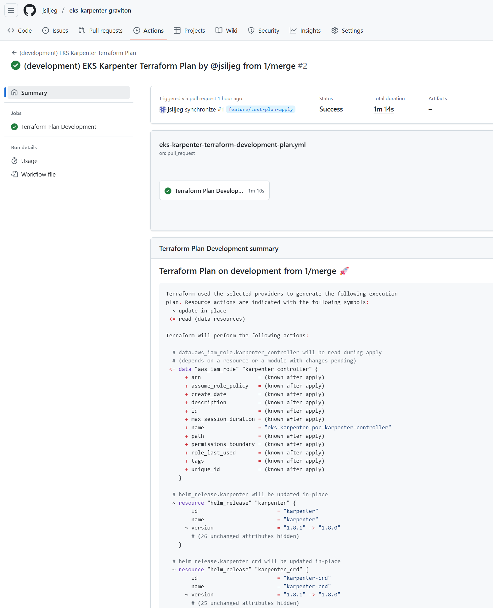
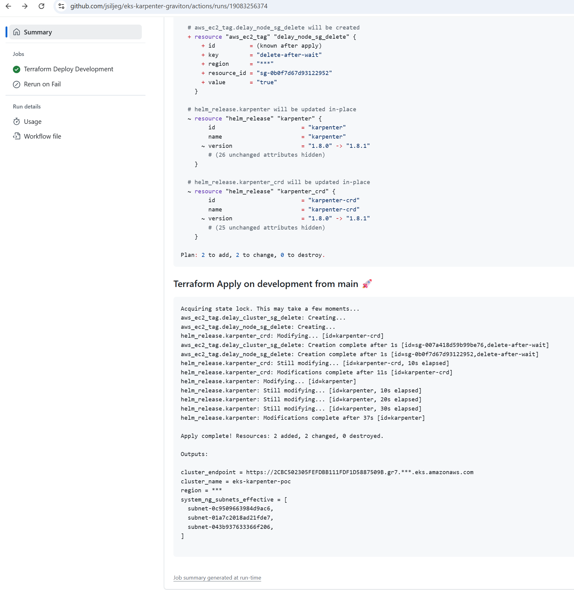
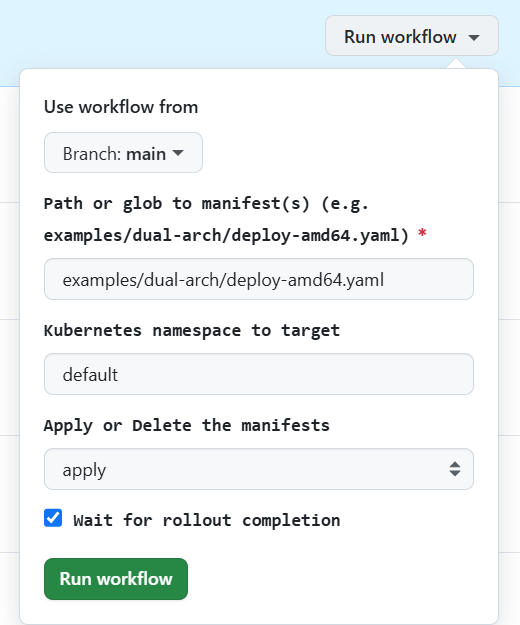
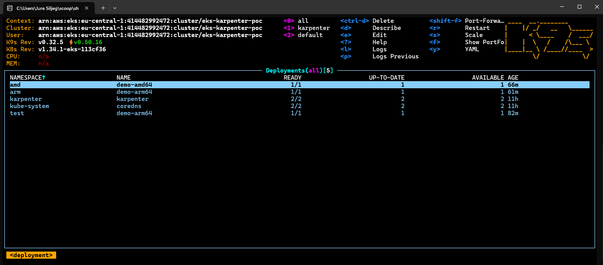

# GitHub CI/CD

This folder contains:
- **Reusable composite actions** (in `.github/actions`) you can call from any workflow
- **Workflows** (in `.github/workflows`) for Terraform plan/apply and for deploying example manifests
- A small **retry** workflow to re-run failed jobs

## Required repository secrets

| Secret | Why |
|---|---|
| `AWS_ACCESS_KEY_ID` | Authenticate AWS for Terraform and `aws eks update-kubeconfig` |
| `AWS_SECRET_ACCESS_KEY` | ^^ |
| `AWS_REGION` | Region for EKS (e.g., `eu-central-1`) |
| `CLUSTER_NAME` | Used by kubeconfig action to target the right cluster |

## Workflows

### 1) “(development) EKS Karpenter Terraform Plan”

- **Triggers**: Pull Requests to `main` that touch the `terraform/environments/development/aws/<region>/eks-karpenter/**` or `terraform/modules/eks-karpenter/**` paths (or manual run)
- **What it does**: Checks out the repo and runs the reusable **terraform-plan** action against that directory
- **Why**: Produce safe diffs before merging infra changes

### 2) “(development) EKS Karpenter Terraform Apply”

- **Triggers**: Pushes to `main` that touch the same Terraform paths
- **What it does**: Executes **terraform-apply** composite action
- **Bonus #1**: Has a dependent job **Retry after fail** to mitigate transient AWS/API hiccups
- **Bonus #2**: Hashing of `.terraform.lock.hcl` and `.terraform` directory

### 3) “Deploy Karpenter Examples”

- **Triggers**: Manual (`workflow_dispatch`)
- **Inputs**:
  - `file`: path/glob to Kubernetes manifests (defaults to `examples/dual-arch/deploy-amd64.yaml`)
  - `namespace`: target namespace
  - `action`: `apply` or `delete`
  - `wait`: whether to `kubectl rollout status` afterward

- **What it does**: Uses the **kubeconfig** action to connect to the cluster, then applies or deletes manifests via the **deploy-manifests** action
- **Why**: Give developers a push‑button way to deploy onto **x86** or **arm64** capacity

### 4) “Retry after fail”

- **Triggers**: Manual with `run_id` (or called from Apply job on failure)
- **What it does**: Uses `gh run rerun --failed` to retry the last failed run
- **Why**: Speed up recovery from flaky network/provider issues

## Composite Actions

- `./.github/actions/aws-config` — prepares AWS credentials and region (thin wrapper)  
- `./.github/actions/terraform-plan` — runs `terraform init` and `terraform plan` and uploads the plan artifact  
- `./.github/actions/terraform-apply` — runs `terraform apply` using the same directory  
- `./.github/actions/kubeconfig` — calls `aws eks update-kubeconfig` for your cluster  
- `./.github/actions/deploy-manifests` — applies/deletes manifests with optional rollout wait

> **Tip:** you can reuse these actions from other repos by copying the folders or converting them into remote actions later.

## #TODO stubs (leave room for future docs)

- Add policy on **who can run Apply** (environments + required reviewers)
- Add a **destroy** workflow (manual and protected)
- Add **OpenTofu** compatibility section if you choose to migrate
